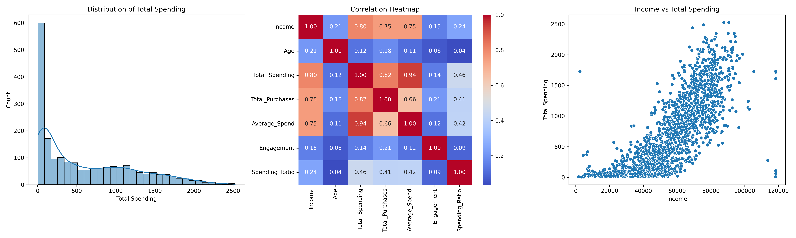

<div align="center">
  <h1>Marketing Analytics Pipeline</h1>
  <p><i>A full-fledged customer analytics machine learning pipeline using Python and Docker.</i></p>

  
  
  
  
</div>

---

## Problem Statement

Understanding customer behavior is crucial for effective marketing. This project aims to analyze customer data to extract actionable business insights and segment the customer base. By automating the data ingestion, preprocessing, analytics, and clustering processes, this pipeline allows marketing teams to:

- **Identify key drivers** of customer spending.
- **Understand the relationship** between demographic factors (like age or income) and purchasing activity.
- **Discover distinct customer segments** to enable targeted, personalized marketing campaigns.

## Team Members

- **Zakaria Ahmed**
- **Salma Ghonim**
- **Yasmin Radwan**

---

## Project Structure

```text
marketing-analytics/
├── Dockerfile
├── requirements.txt
├── ingest.py          # Loads raw data
├── preprocess.py      # Cleans and engineers features
├── analytics.py       # Extracts business insights
├── visualize.py       # Generates data plots
├── cluster.py         # Performs K-Means clustering
├── summary.sh         # Bash script to export results from docker
├── README.md
├── .gitignore
├── data/
│   ├── marketing_campaign.xlsx
│   ├── data_preprocessed.csv
│   └── *.ipynb (Analysis notebooks)
└── results/
    └── (Outputs generated here after running the pipeline)
```

---

## Pipeline Execution Flow

The pipeline follows a sequential, automated execution model where each stage triggers the next:

1. **`ingest.py`** → Loads raw data and passes it to preprocessing.
2. **`preprocess.py`** → Cleans the data, performs feature engineering, handles missing values, and saves `data_preprocessed.csv`.
3. **`analytics.py`** → Extracts 3 key business insights based on spending, age, and engagement grouping, then saves text files.
4. **`visualize.py`** → Generates correlational and distributional visualizations and saves `summary_plot.png`.
5. **`cluster.py`** → Executes PCA clustering (K-Means), saves silhouette scores, and assigns clustered labels to the data.

---

## How to Run Locally

First, install the necessary requirements:

```bash
pip install -r requirements.txt
```

**Option A:** Run the complete pipeline from scratch, starting with ingestion:
```bash
python ingest.py data/marketing_campaign.xlsx
```

**Option B:** Start from the preprocessed data (skipping ingestion and preprocessing):
```bash
python analytics.py data/data_preprocessed.csv
```

Outputs will be generated in your current working directory.

---

## How to Run using Docker

A `Dockerfile` is provided so you can run the pipeline inside an isolated environment.

### 1. Build the Docker Image
```bash
docker build -t marketing-analytics .
```

### 2. Run the Container
Start an interactive shell session inside the container:
```bash
docker run -it --name marketing_analytics_container marketing-analytics
```

### 3. Run the Pipeline inside Docker
Once inside the running container, trigger the full pipeline starting with ingestion:
```bash
python ingest.py data/marketing_campaign.xlsx
```
*(Optionally, type `exit` to return to your host machine.)*

### 4. Export Results
From your host machine, run `summary.sh` to extract the generated insight files, plots, and clustered datasets into the locally synced `./results/` folder. This script will also clean up the Docker container for you:
```bash
./summary.sh
```

---

## Results & Insights

The pipeline executes comprehensive analysis and produces the following key findings, easily accessible in the `results/` folder.

### 1. Visualizations

*(Generated automatically by `visualize.py`)*

### 2. Structural Business Insights

| Insight Area | Key Finding |
| :--- | :--- |
| **Income vs. Spending** | Customers in the **High income group** have the highest average total spending `(1263.94)`. This strongly suggests income level fundamentally drives customer spending behavior. |
| **Age vs. Purchase Frequency** | The **Senior age group** engages in the most purchases `(14.23)` on average compared to younger groups. Customer age is a strong indicator of purchase activity. |
| **Spending vs. Engagement** | The **High spending group** dominates response rates `(0.2530)` and engagement `(1.0200)`. Spending behavior is tightly coupled with marketing responsiveness. |

### 3. Customer Segmentation (Clustering)

A **K-Means** clustering approach was applied to segment customers, ensuring data-driven personalized marketing strategies.

- **Optimal Clusters (k):** `4`
- **Silhouette Score:** `0.3279` *(indicating a reasonable clustering structure)*
- **Cluster Breakdown:**
  - **Cluster 0:** 469 members
  - **Cluster 1:** 584 members
  - **Cluster 2:** 458 members
  - **Cluster 3:** 515 members

---

## Links

- **Github Repo:** [zakariahmedd34/marketing-analytics](https://github.com/zakariahmedd34/marketing-analytics)
- **Docker Hub Image:** [yasminradwan/marketing-analytics](https://hub.docker.com/repository/docker/yasminradwan/marketing-analytics/general)
